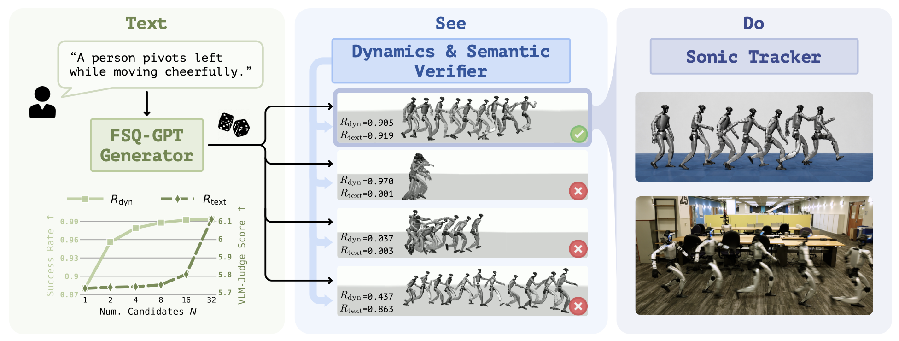

<h1 align="center">TEXEDO 🤵🏻: Test-Time Scaling for Controller-Aware Language-Conditioned Humanoid Motion Generation</h1>

<p align="center">
  <a href="https://jianuocao.github.io/TEXEDO/"></a>
  <a href="https://arxiv.org/abs/2606.22998"></a>
  <a href="https://huggingface.co/datasets/JianuoCao/TEXEDO"></a>
  <a href="https://huggingface.co/JianuoCao/TEXEDO-Checkpoint"></a>
</p>

<p align="center">
  <a href="https://jianuocao.github.io">Jianuo Cao</a><sup>*1,2</sup>,
  <a href="https://thomaschen98.github.io">Yuxin Chen</a><sup>*2</sup>,
  <a href="https://amysong-robotics.github.io">Yuzhen Song</a><sup>2,3</sup>,
  <a href="https://me.berkeley.edu/people/masayoshi-tomizuka/">Masayoshi Tomizuka</a><sup>2</sup>,
  <a href="https://www.linkedin.com/in/chenran-li-b70078197/">Chenran Li</a><sup>2</sup>,
  <a href="https://thomasrantian.github.io">Ran(Thomas) Tian</a><sup>2</sup>
</p>

<p align="center">
  <sup>1</sup>Nanjing University &nbsp;&nbsp;
  <sup>2</sup>University of California, Berkeley &nbsp;&nbsp;
  <sup>3</sup>Southern University of Science and Technology
</p>

<p align="center">
  
</p>

TEXEDO is a text-to-motion pipeline for the Unitree G1 humanoid. It generates multiple candidate motions from a language prompt, decodes them into a 36-dimensional g1 robot motion format, scores them with dynamic and semantic verifiers, and selects the best candidate for deployment.

## Highlights

- FSQ motion tokenizer for Unitree G1 motion.
- FLAN-T5 generator over discrete motion tokens.
- Dynamic and semantic verifiers for humanoid motion scoring and reward modeling.


## TODOs

- [x] Release datasets.
- [x] Release checkpoints for the tokenizer, generator, and verifiers.
- [x] Open-source the training pipeline.
- [ ] Publish a fast, large-scale controller-aware data collection pipeline.
- [ ] Add functional demos for text-to-motion, motion-to-text, and motion prediction.

## Installation

```bash
git clone https://github.com/JianuoCao/TEXEDO.git
cd TEXEDO

conda env create -f environment.yml
conda activate TEXEDO
pip install -e .
```

By default, TEXEDO stores checkpoints in `./assets` and datasets in `./data`. You can override these locations:

```bash
export TSD_ASSETS=/path/to/assets
export TSD_DATA=/path/to/data
```

## Download Assets

The dataset lives at [`JianuoCao/TEXEDO`](https://huggingface.co/datasets/JianuoCao/TEXEDO). Checkpoints and runtime assets live at [`JianuoCao/TEXEDO-Checkpoint`](https://huggingface.co/JianuoCao/TEXEDO-Checkpoint).

```bash
python scripts/download_assets.py --dry-run
python scripts/download_assets.py
```

`--dry-run` only prints what would be downloaded. The second command downloads checkpoints, verifiers, GloVe files, and the G1 robot assets into `assets/`.

## Inference

Generate candidates, score them, select the best motion, and render it:

```bash
python -m pipeline.generate \
  --prompt "a person waves with the right hand" \
  --num-samples 8 \
  --out-dir candidates/

python -m pipeline.score \
  --motion-dir candidates/ \
  --caption "a person waves with the right hand" \
  --output scores.csv

python -m pipeline.select_best_of_n \
  --scores scores.csv \
  --motion-dir candidates/ \
  --copy-best-to best/

python scripts/visualize_csv.py --input-dir best/ --output-dir viz/
```

For generator-only sampling:

```bash
cd generator
python demo.py --task t2m --num_samples 5 \
  --cfg configs/config_fsq_multitask.yaml \
  --cfg_assets configs/assets.yaml
```

## Data Preparation

Inference uses the released checkpoints and does not require dataset preparation. For training, prepare the public dataset into the local `CustomCombined` layout:

```bash
python generator/scripts/prepare_dataset.py
```

This downloads the dataset, flattens motions/texts, copies split files, and regenerates FSQ token files under `data/CustomCombined/`.

## Training

The released checkpoints are ready to use. To reproduce or retrain components, see [docs/REPRODUCE.md](docs/REPRODUCE.md). Main entry points:

```bash
# FSQ tokenizer
python tokenizer/fsq_train.py --config tokenizer/configs/fsq_combined.yaml

# Generator
cd generator && python train.py --cfg configs/config_fsq_multitask.yaml --cfg_assets configs/assets.yaml --nodebug

# Semantic verifier
python verifiers/semantic/train_evaluator.py --config verifiers/semantic/configs/evaluator.yaml --step all


```

## Documentation

- [docs/FORMAT.md](docs/FORMAT.md): 36-dim Unitree G1 motion format.
- [docs/DATA.md](docs/DATA.md): dataset layout and preparation.
- [docs/MODELS.md](docs/MODELS.md): checkpoints and runtime assets.
- [docs/REPRODUCE.md](docs/REPRODUCE.md): end-to-end reproduction notes.

## Citation

```bibtex
@misc{cao2026texedotesttime,
      title={TEXEDO : Test Time Scaling for Controller-aware Language-conditioned Humanoid Motion Generation},
      author={Jianuo Cao and Yuxin Chen and Yuzhen Song and Masayoshi Tomizuka and Chenran Li and Thomas Tian},
      year={2026},
      eprint={2606.22998},
      archivePrefix={arXiv},
      primaryClass={cs.RO},
      url={https://arxiv.org/abs/2606.22998},
}
```

## License

The code in this repository is released under the MIT license. Third-party datasets, pretrained models, robot assets, and dependencies retain their own licenses and terms of use.
